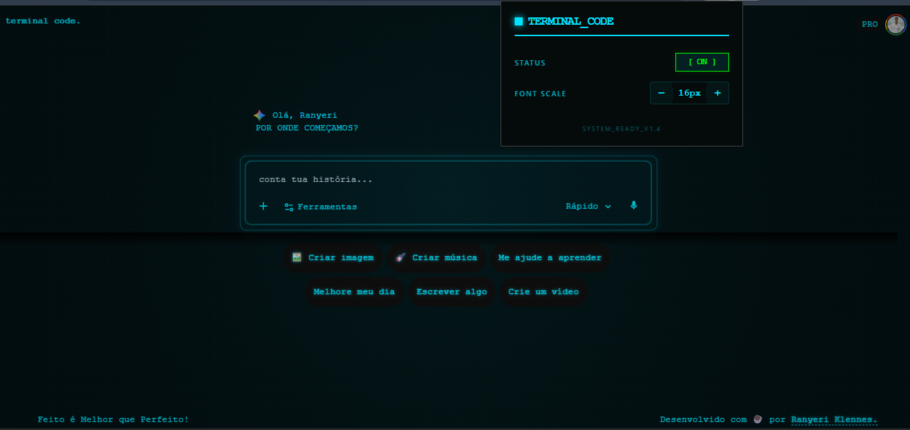

# 📟 Terminal Code: Gemini Retro Theme

### 💡 O Problema e a Solução
Interfaces de chat web geralmente possuem largura fixa e centralizada para atender ao usuário comum. Porém, para desenvolvedores usando monitores largos (ultrawide), isso resulta em espaço desperdiçado e blocos de código espremidos, o que prejudica a leitura.

O **Terminal Code** é uma extensão de navegador focada em melhorar essa experiência de usuário (UX). Ela atua injetando scripts no DOM do Google Gemini para:
1. **Expandir o layout útil** para 98% da tela, facilitando a leitura de scripts extensos.
2. **Reduzir a carga cognitiva**, tornando a barra lateral retrátil e ocultando elementos distratores.
3. **Aplicar uma interface focada** (estética Retro CRT) com controle dinâmico de tamanho de fonte, garantindo que a formatação de tags nativas de código (`<pre>` e `<code>`) não seja quebrada.

### 🛠️ Tecnologias e Arquitetura
* **Ecossistema:** Chrome Extension API (Manifest V3).
* **Core:** JavaScript Vanilla (Manipulação avançada de DOM) e CSS3.
* **Persistência de Estado:** Implementação de `chrome.storage.local` para salvar as preferências do usuário (status do tema e tipografia) no navegador.
* **Performance:** Arquitetura isolada via `content.js`, modificando a interface do serviço de terceiros sem causar gargalos no tempo de carregamento nativo.

### 🚀 Como testar na sua máquina
1. Clone este repositório no seu computador.
2. No seu navegador (Chrome, Edge, Brave), acesse `chrome://extensions/` e ative o **"Modo do desenvolvedor"** no canto superior direito.
3. Clique em **"Carregar sem compactação"** (Load unpacked) e selecione a pasta raiz do repositório. A extensão será ativada automaticamente no Gemini.
